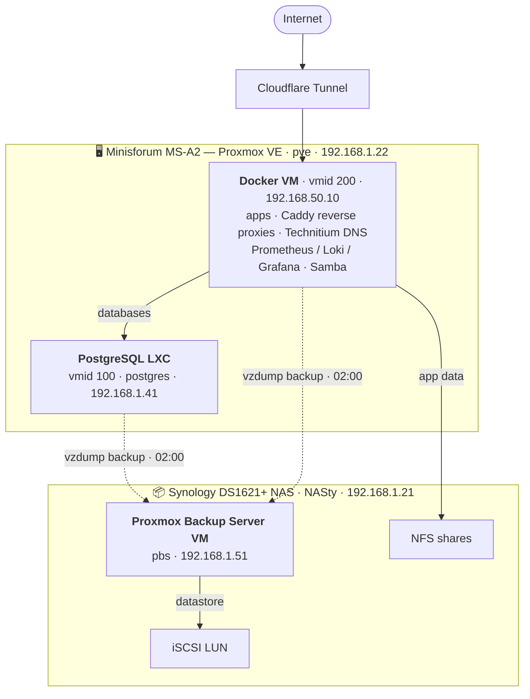

# Homelab

This repository contains the configuration files and documentation for my homelab setup. It includes various services
and applications that I and my family rely on.

The homelab (or self-hosted environment) runs on a [Minisforum MS-A2](https://minisforumpc.eu/products/ms-a2-mini-pc)
and a Synology DS1621+ NAS, and is managed with [pyinfra](https://pyinfra.com/).

> The homelab used to be split across two configuration management systems — a legacy Ansible setup driving the NAS and
> this pyinfra setup. The Ansible setup has been split out into a separate archived repository
> ([`homelab-old`](https://github.com/DonDebonair/homelab-old)); this repository is now pyinfra-only.

## Topology

Two physical machines: the **Minisforum MS-A2** runs Proxmox VE and hosts the guests (a PostgreSQL LXC and a Docker
VM); the **Synology DS1621+ NAS** provides NFS shares and an iSCSI LUN, and also runs the Proxmox Backup Server as a VM
(via Synology Virtual Machine Manager). The Docker VM lives on VLAN 50 (`192.168.50.0/24`, bridge `vmbr50`); everything
else sits on the main LAN (`192.168.1.0/24`, bridge `vmbr0`).

## Pyinfra

**Main entrypoint**: `deploy.py`

**Inventory**: `inventory.py`

**Relevant directories**:

- `deploys/`: pyinfra deploys for different services and applications.
- `facts/`: custom pyinfra facts for Proxmox and Synology.
- `operations/`: custom pyinfra operations for Proxmox and Synology.
- `models/`: models for custom pyinfra facts and operations.
- `op_secrets/`: custom string class for handling secrets in pyinfra with 1password.
- `group_data/`: data for pyinfra groups of hosts.
- `commands/`: CLI helpers (entrypoint `cmd.py`) for provisioning new PostgreSQL databases
  and OIDC clients — generating credentials, creating the 1Password items, and editing the
  relevant deploy config. See `commands/README.md`.

**Main commands**:

All pyinfra commands should be run through `uv`.

- `uv run pyinfra inventory.py deploy.py -y`: Run the pyinfra deploy to configure the homelab. Optionally, you can
  deploy only specific hosts or groups of hosts, e.g. `uv run pyinfra inventory.py deploy.py -y --limit postgres_lxc`
  to only deploy the Postgres LXC.
  You can also specify a particular deploy to run,
  e.g. `uv run pyinfra inventory.py deploys.docker_vm.users -y --limit docker_vm` to only run the users deploy for the
  Docker VM.
